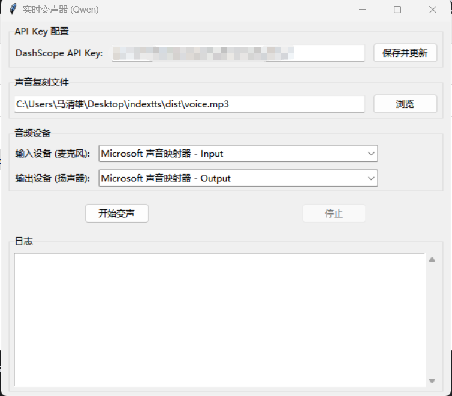

# 基于 Qwen 的实时变声器

本项目是一个基于 Python 实现的实时语音助手。它能够通过麦克风捕捉声音，使用阿里云通义千问 (Qwen) Omni ASR 进行实时语音转文字，然后使用具备声音复刻功能的 Qwen TTS 将文字合成为语音。

## 功能特性

- **实时流式 ASR**：持续监听您的声音并实时转换为文字。
- **声音复刻 TTS**：使用从本地音频文件 (`voice.mp3`) 复刻的自定义音色合成语音。
- **连续对话**：支持“监听-说话”的连续循环，并具备自动打断处理功能。
- **持久连接**：为 ASR 和 TTS 服务维护持久的 WebSocket 连接，以优化延迟。

## 界面预览（windows可以直接打开dist里面的exe使用）


## 前置要求

- Python 3.8 或更高版本。
- 阿里云 DashScope API Key。
- **PortAudio** (PyAudio 的依赖库):
    - **Windows**: 通常通过 `pip install pyaudio` 自动安装。
    - **macOS**: `brew install portaudio`
    - **Linux**: `sudo apt-get install python3-pyaudio` 或 `sudo apt-get install portaudio19-dev`

## 安装步骤

1. 克隆仓库或下载源代码。
2. 安装所需的 Python 依赖包：

   ```bash
   pip install -r requirements.txt
   ```

3. 确保项目根目录下有一个 `voice.mp3` 文件。该文件用于生成 TTS 的声音复刻。

## 配置说明

### API Key

本项目使用阿里云 DashScope SDK。您需要配置您的 API Key。
您可以将其设置为环境变量：

```bash
# Windows (PowerShell)
$env:DASHSCOPE_API_KEY = "your-api-key"

# Linux/macOS
export DASHSCOPE_API_KEY="your-api-key"
```

*注意：请务必配置环境变量，否则程序无法正常运行。*

## 使用方法

运行主脚本以启动助手：

```bash
python main.py
```

### 图形界面 (GUI) 版本

如果您更喜欢图形化操作，可以使用我们提供的 GUI 版本：

```bash
python gui.py
```

**GUI 功能特性：**

*   **声音文件选择**：方便地浏览并选择用于声音复刻的音频文件。
*   **设备选择**：通过下拉菜单选择特定的输入（麦克风）和输出（扬声器）设备，无需修改代码。
*   **可视化控制**：简单的“开始”和“停止”按钮来控制变声过程。
*   **实时日志**：界面内置日志窗口，实时显示运行状态。

### 工作原理

1. 程序初始化 ASR 和 TTS 服务的连接。
2. 立即开始监听麦克风。
3. 当您说话时，音频会被流式传输到云端进行识别。
4. 一旦识别出完整的句子，程序会暂停录音，并使用复刻的声音朗读该文本。
5. 朗读结束后，程序会自动恢复监听。

按 `Ctrl+C` 可停止程序。

## 项目结构

- `main.py`: 程序入口。处理主循环、音频录制，并协调 ASR 和 TTS。
- `gui.py`: 图形界面版本入口。提供设备选择、文件选择和可视化控制。
- `asr.py`: 包含 `ASRClient` 类，用于处理实时语音识别。
- `qwen3tts.py`: 包含 `TTSClient` 类，用于处理语音合成和声音复刻。
- `requirements.txt`: Python 依赖列表。
- `voice.mp3`: (必须) 用于声音复刻的源音频文件。
- `voice_id.txt`: (自动生成) 缓存生成的 Voice ID，避免重复调用 API。

## 故障排除

- **音频设备错误**：如果 `pyaudio` 无法打开流，请确保您的麦克风已连接且可访问。
- **API 错误**：请检查您的网络连接，并确保您的 DashScope API Key 有效且有足够的配额。
